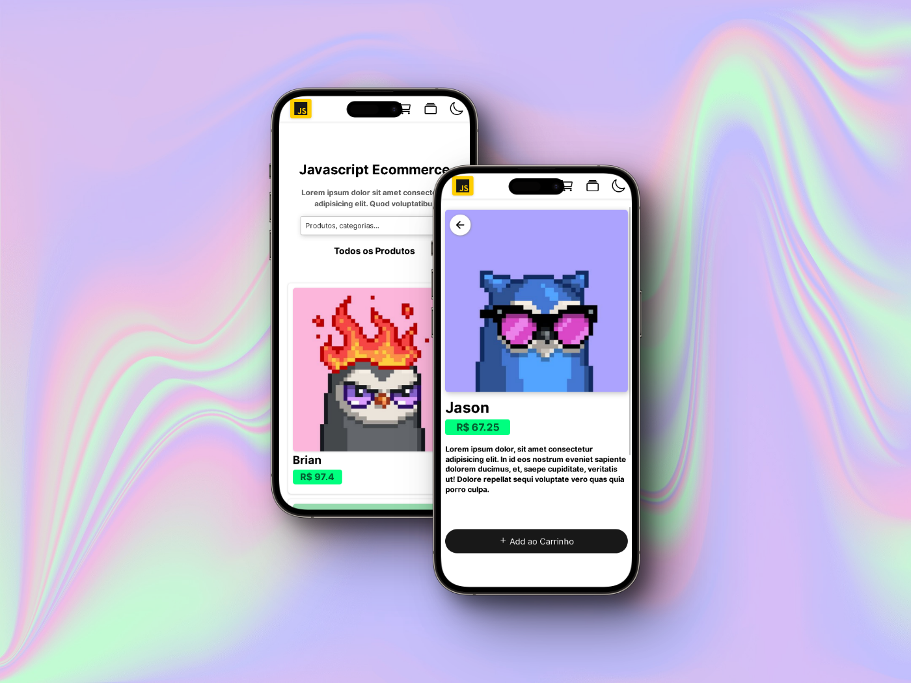

# ecommerce-js 📦 
> (ainda nao tenho um nome bonito)
### Ecommerce single page application em react com foco em SEO, Roteamento e Mobile First

### Requisitos iniciais
Este projeto tem como foco, desenvolver um SPA de ecommerce com os seguintes tópicos e requisitos funcionais:
 - Homepage com pesquisa para todos os produtos (usando filtragem da dom);
 - "Página" dinamica de produto clicado pelo usuario;
 - "Página" de carrinho do produto que for selecionado para compra;
 - Dark Mode

### Tenologias
Para o desenvolvimento do projeto, estou inicialmente pensando em usar **ReactJS**, tanto para aprender de vez e me acostumar com a forma de desenvolver com este framework, tanto para usar a hospedagem da **Vercel**, se eu conseguir unir a performance e SEO de um site em react e o servidores da vercel, será uma aplicação altamente performática que, se usada com produtos reais e conteúdos relevantes, com certeza terá um ótimo posicionamento orgânico.
 
 
### Features do futuro
Alguns requisitos de início que não farão parte do projeto inicial, mas ainda penso em inseri-los são:
 - "Página" de checkout usando algum meio de pagamento;
 - Solução de Postagem para o usuário;
 - Chatbot de tira dúvidas (jivo ou Talk2);
 - Color variation para produtos;
 - Blog page para SEO.
 
